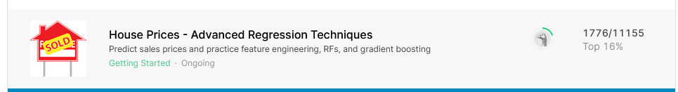

<h2> House-Prices---Advanced-Regression-Techniques </h2>

<a href = "https://www.kaggle.com/c/house-prices-advanced-regression-techniques/overview" > Kaggle соревнование </a> по предсказанию цены недвижимости.

<h3> Описание решения </h3>

 
  <ol>
     <li>
     Визуальный анализ данных, попытка понять каким образом лучше перекодировать категориальные признаки. Файл - <b> look_att_the_data.ipynb </b>
     </li>
     <li>
       Формирование выборки для обучения, генерация новых признаков. Файл - <b> preprocessing.ipynb </b>
     </li>
     <li>
       Обучение ансамбля моделей подбор гиперпараметров. Предсказание цены на недвижимость по тестовым данным. Файл - <b> preprocessing.ipynb </b>
     </li>
  </ol>

<h3> Результаты </h3>

